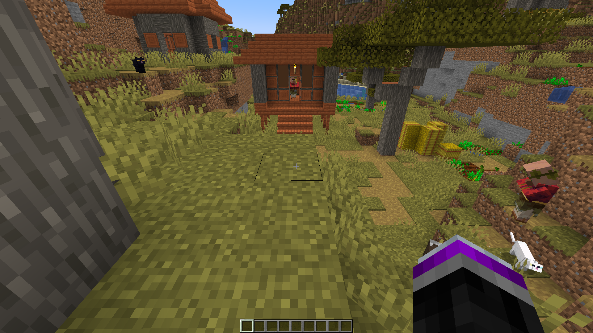
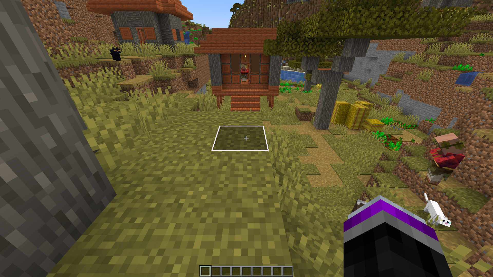
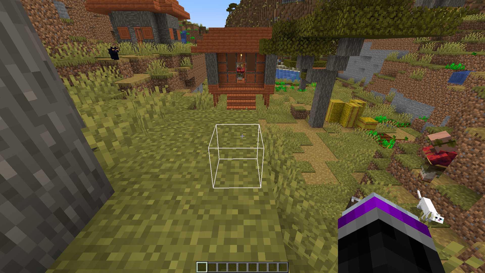
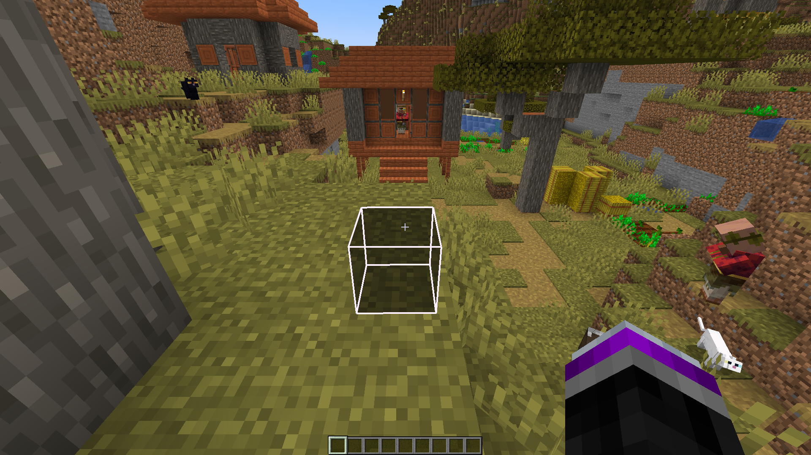
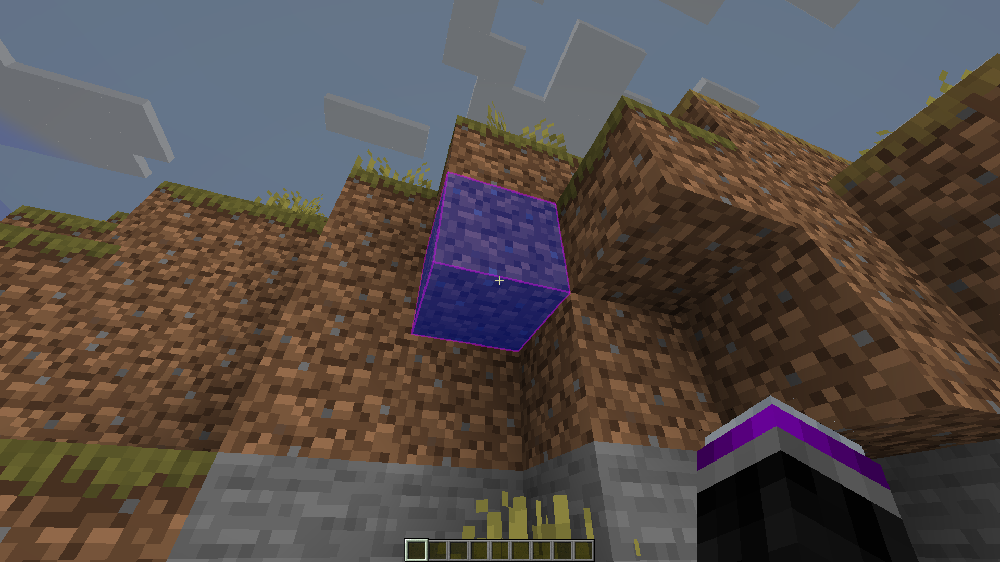
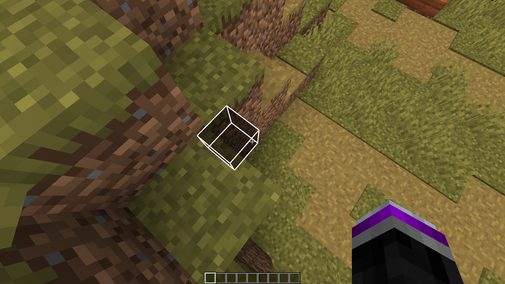
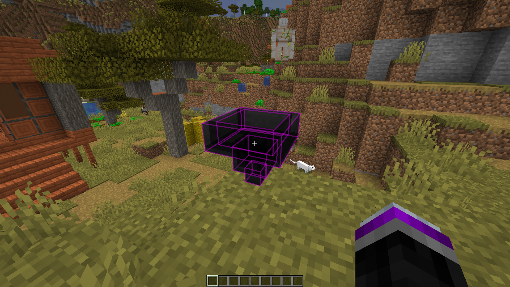
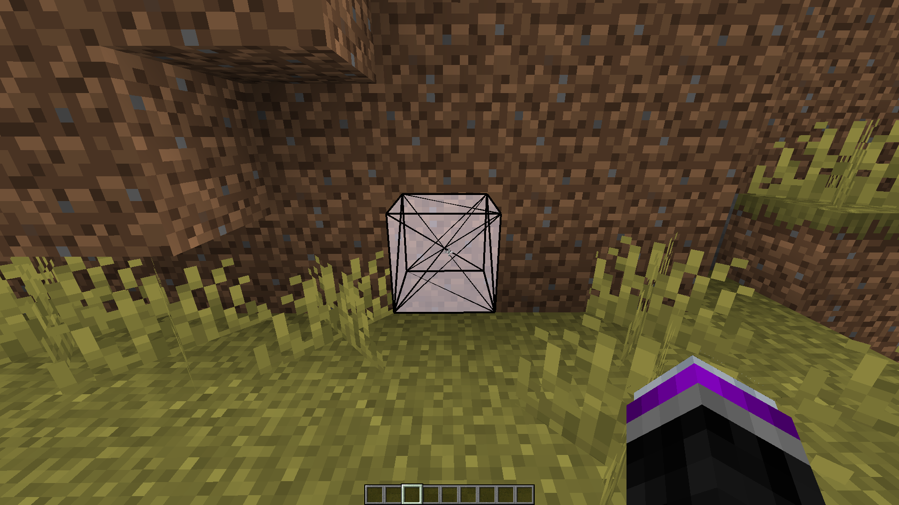
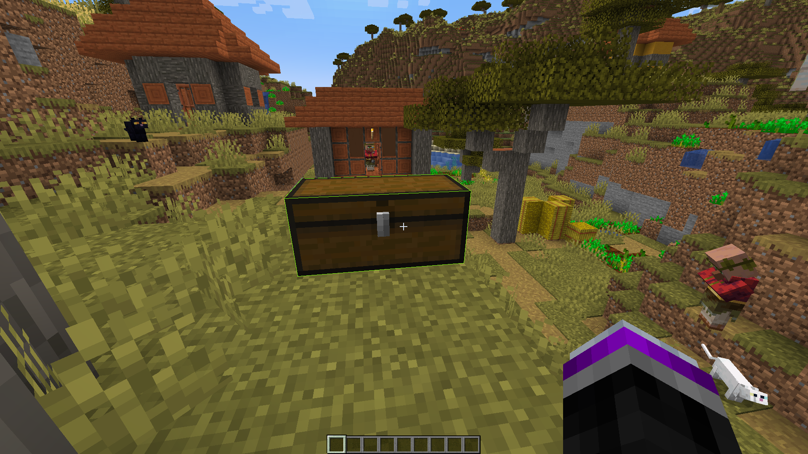

> ## :warning: This project has been moved to: https://gitlab.com/matteo4375/BetterBlockOutline

# BetterBlockOutline

[.svg?badge_style=for_the_badge)](https://www.curseforge.com/minecraft/mc-mods/betterblockoutline)
[.svg?badge_style=for_the_badge)](https://www.curseforge.com/minecraft/mc-mods/betterblockoutline)

BetterBlockOutline is a client sided Minecraft mod that allows for ample customization of the block outline. Everything from color customization to debug information.

There are different color effects you can apply to the fill color or the outline color. Chroma, blink, and more coming!

[MaLiLib](https://www.curseforge.com/minecraft/mc-mods/malilib) is required run and [Mod Menu](https://www.curseforge.com/minecraft/mc-mods/modmenu) for configuration.

Join the [Discord](https://discord.gg/WnaE3uZxDA) for help.

## Screenshots

Default 

Fill 

See through 

See through with fill 

Colors 

See through at an angle 

Complicated model 

Strips mode 

Double block 

More in `./screenshots`

## Support

If you want to support this mod I would heavily appreciate it if you would share it with your friends. Feel free to come to the [Discord](https://discord.gg/WnaE3uZxDA) to submit bugs, request features, or just hang around.

## Credits

Code & Mastermind: DarkKronicle

Language man: Chronos22 (You would not understand the mod without this guy)
